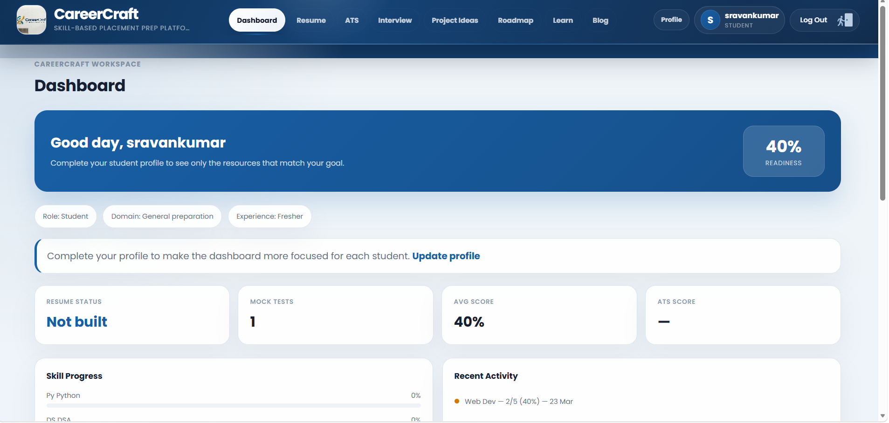
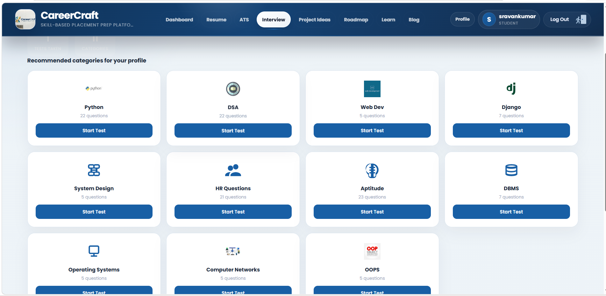
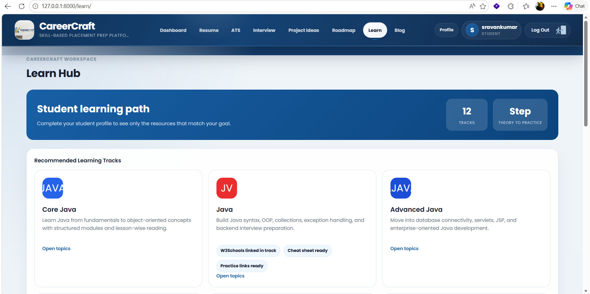
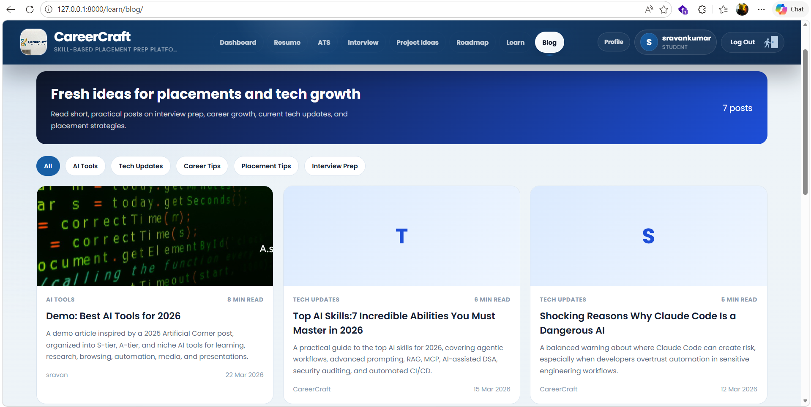
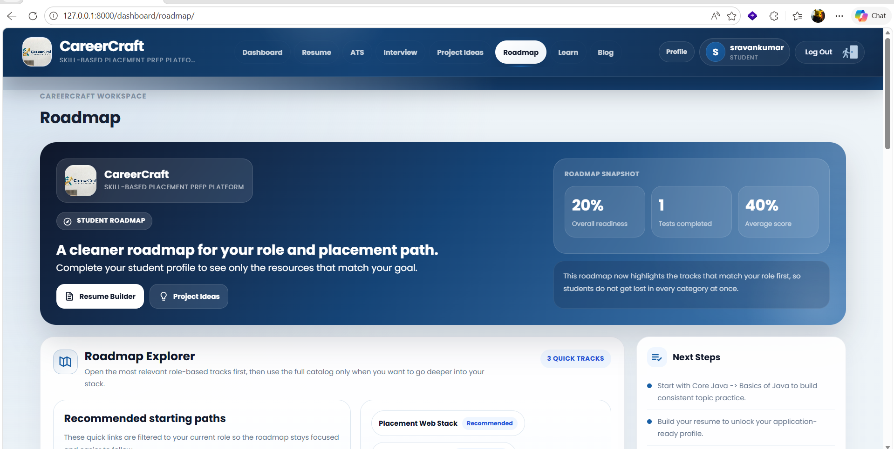

# CareerCraft

CareerCraft is a full-stack Django web application for career and placement preparation. It brings together resume building, ATS analysis, interview practice, assessments, learning content, and a personalized dashboard in one place.


## Project Screenshots

### Dashboard



### Resume Builder


### ATS Analyzer


### Interview Practice



### Learning Section



### Blog



### Roadmap



### User Profile


### Admin Dashboard


## Features

- User authentication with login, registration, profile management, and password reset
- Resume builder with PDF download support
- ATS resume checking tools
- Interview practice with category-based quiz flows and results
- Skill assessments with topic-based question flows
- Learning section with lessons, languages, blog posts, and comments
- Dashboard pages for roadmap planning and content management

## Tech Stack

- Python
- Django
- Bootstrap 5
- SQLite

## Project Structure

```text
CareerCraft/
|-- accounts/
|-- assessment/
|-- ats/
|-- dashboard/
|-- interview/
|-- learn/
|-- resume/
|-- static/
|-- templates/
|-- media/
|-- images/
|-- careercraft/
|-- manage.py
```

## Run Locally

```bash
python -m venv venv
venv\Scripts\activate
pip install -r requirements.txt
python manage.py migrate
python manage.py runserver
```

Open `http://127.0.0.1:8000/` in your browser.

## Note

This project is currently available on GitHub and is not fully deployed yet. The screenshots above provide a visual preview of the main project modules and user flows.
